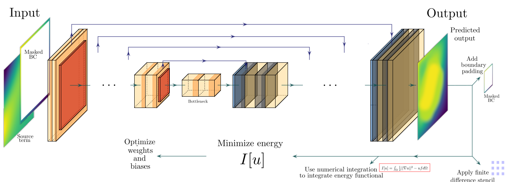

# Deep convolutional Ritz method: parametric PDE surrogates without labeled data

  - Author: Jan N Fuhg
  - Organization: Cornell University

The parametric surrogate models for partial differential equations (PDEs)
are a necessary component for many applications in computational sciences, and the
convolutional neural networks (CNNs) have proven to be an excellent tool to generate
these surrogates when parametric fields are present. CNNs are commonly trained on labeled data based on one-to-one sets of parameter-input and PDE-output fields. Recently,
residual-based deep convolutional physics-informed neural network (DCPINN) solvers for
parametric PDEs have been proposed to build surrogates without the need for labeled
data. These allow for the generation of surrogates without an expensive offline-phase. In
this work, we present an alternative formulation termed deep convolutional Ritz method
(DCRM) as a parametric PDE solver. The approach is based on the minimization of energy functionals, which lowers the order of the differential operators compared to residualbased methods. Based on studies involving the Poisson equation with a spatially parameterized source term and boundary conditions, we find that CNNs trained on labeled data
outperform DCPINNs in convergence speed and generalization abilities. The surrogates
generated from the DCRM, however, converge significantly faster than their DCPINN
counterparts, and prove to generalize faster and better than the surrogates obtained from
both CNNs trained on labeled data and DCPINNs. This hints that the DCRM could
make PDE solution surrogates trained without labeled data possible.

## References
If you use part of this code consider citing:

[1] Fuhg, J. N., et al. "Deep convolutional Ritz method: parametric PDE surrogates without labeled data." Applied Mathematics and Mechanics 44.7 (2023): 1151-1174.

## License

This package comes with ABSOLUTELY NO WARRANTY. This is free
software, and you are welcome to redistribute it under the conditions of
the GNU General Public License
([GPLv3](http://www.fsf.org/licensing/licenses/gpl.html))
